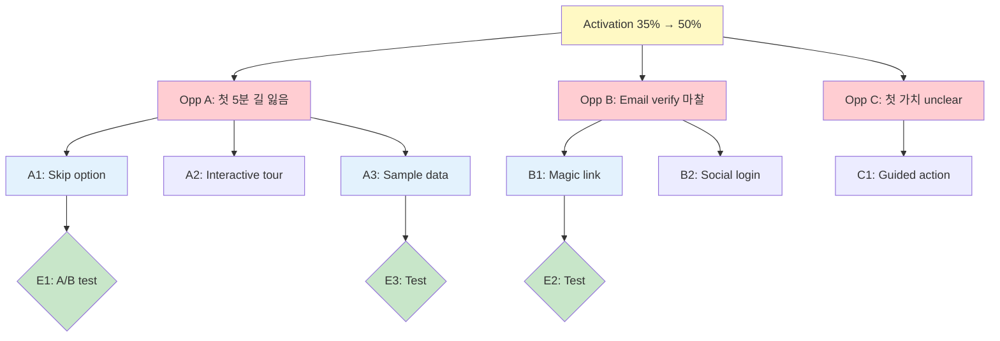

# Opportunity Solution Tree (OST)

> Teresa Torres의 핵심 도구. Outcome → Opportunity → Solution → Experiment.
> Continuous Discovery Habits의 backbone.

---

# OST — [프로젝트명] / [Outcome]

> **Last updated**: YYYY-MM-DD
> **Owner**: PM (Trio: PM + Designer + Engineer)

---

## 1. 구조

```
                    OUTCOME (비즈니스 결과)
                          |
        ┌─────────────────┼─────────────────┐
        │                 │                 │
   OPPORTUNITY A    OPPORTUNITY B    OPPORTUNITY C
   (사용자 문제)    (사용자 문제)    (사용자 문제)
        │                 │
   ┌────┼────┐       ┌────┼────┐
   S1   S2   S3      S4   S5   S6
   │    │    │       │    │    │
   E1   E2   E3      E4   E5   E6
   (실험)

S = Solution, E = Experiment
```

---

## 2. Outcome (최상위)

### Outcome 정의

**Outcome**: [측정 가능한 결과]

**Current**: [현재 수치]
**Target**: [목표 수치]
**Owner**: PM
**Quarter**: Qx YYYY

### 예시

**Outcome**: Activation rate 35% → 50%
- Current: 35% (가입자 중 first value 경험)
- Target: 50% (분기말)
- Why: Activation은 Retention의 선행지표, Activation +15%p 시 MRR 30% 증가 예상

---

## 3. Opportunities (사용자 문제)

각 Opportunity는 인터뷰/데이터 기반 발견된 **사용자 문제**.

### 작성 원칙
- ❌ "더 빠른 onboarding" (solution)
- ✅ "사용자가 첫 5분 안에 길을 잃음" (problem)

### Opportunity Template

```
Opportunity: [사용자가 겪는 구체적 문제]

증거:
- 인용구: "...."
- 데이터: drop-off 50% at step 3
- 빈도: 65% of new users

영향:
- Activation rate 영향: ~10%p 가능성
- 사용자 수: 분기 1,000명

우선순위 (Confidence + Impact):
🔴 High (확실, 큰 영향)
🟡 Medium (가능성, 중간 영향)
🟢 Low (실험적, 학습용)
```

### Opportunity A: 사용자가 첫 5분 안에 길을 잃음

**증거**:
- 인터뷰 8건 중 5건: "처음에 뭘 해야 할지 모르겠어요"
- 데이터: Step 3 (workspace setup) drop-off 50%
- 세션 replay: 평균 2분 idle

**영향**: Activation 의 ~10%p

**우선순위**: 🔴 High

---

### Opportunity B: Email verification 마찰

**증거**:
- 가입자 30%가 인증 메일 클릭 안 함
- 인터뷰: "다른 일 하느라 잊었어요"

**영향**: 가입 → 인증 funnel 30% loss

**우선순위**: 🔴 High

---

### Opportunity C: 첫 가치 unclear

**증거**:
- 인터뷰 8건 중 6건: "근데 이게 뭐가 좋은 건지 안 와닿아요"
- 첫 세션 평균 5분만

**영향**: Activation의 ~5%p

**우선순위**: 🟡 Medium

---

## 4. Solutions (각 Opportunity 마다)

### Opportunity A → Solutions

#### Solution A1: Skip tutorial option
**Description**: 튜토리얼 강제 → optional, "Skip" 버튼 추가
**Effort**: S (1 person-week)
**Confidence**: High (similar pattern works at Linear)
**Expected Impact**: +5%p activation

#### Solution A2: Interactive guided tour
**Description**: 정적 튜토리얼 → 사용자가 실제 액션하며 학습
**Effort**: L (1 person-month)
**Confidence**: Medium
**Expected Impact**: +8%p activation

#### Solution A3: Default workspace + sample data
**Description**: 빈 화면 → 예시 워크스페이스 자동 생성
**Effort**: M (2 person-weeks)
**Confidence**: High
**Expected Impact**: +7%p activation

---

### Opportunity B → Solutions

#### Solution B1: Magic link (no password)
**Description**: 패스워드 대신 이메일 링크 클릭
**Effort**: M
**Confidence**: High
**Expected Impact**: 인증 30% loss → 10% loss

#### Solution B2: 소셜 로그인 (Google + Kakao)
**Description**: 이메일 외 OAuth
**Effort**: M
**Confidence**: High
**Expected Impact**: Email verification 자체 불필요

---

### Opportunity C → Solutions

#### Solution C1: Guided first action
**Description**: 가입 직후 "30초만에 첫 [데이터] 만들기" CTA
**Effort**: M
**Confidence**: Medium
**Expected Impact**: First value experience +20%

---

## 5. Solution 평가 (RICE)

| Solution | Reach | Impact | Confidence | Effort | RICE |
|----------|-------|-------|----------|--------|------|
| A1 Skip tutorial | 1000 | 1 | 80% | 0.25 | 3,200 |
| A3 Sample data | 1000 | 2 | 70% | 0.5 | 2,800 |
| B1 Magic link | 1000 | 2 | 80% | 0.5 | 3,200 |
| B2 Social login | 1000 | 3 | 90% | 1 | 2,700 |
| C1 Guided action | 800 | 2 | 60% | 0.5 | 1,920 |
| A2 Interactive | 1000 | 3 | 60% | 2 | 900 |

**Top 3 priorities**:
1. A1 (Skip tutorial) — quick win
2. B1 (Magic link) — 큰 임팩트, 작은 노력
3. A3 (Sample data) — visual impact

---

## 6. Experiments (Solution 검증)

각 우선순위 Solution에 대해 실험 설계:

### Experiment E1: Skip tutorial A/B test

**Hypothesis**: Skip option 추가 → Activation +5%p
**Variant**: Skip button (50%) vs No skip (50%)
**Primary metric**: First value experience rate
**Duration**: 2 weeks (sample 6,000)
**Decision**: Significant lift → ship to 100%

→ 상세: `05-experimentation-plan.md`

### Experiment E2: Magic link rollout

**Hypothesis**: Magic link → email verification rate 70% → 90%
**Approach**: New users only, 50/50 split
**Primary metric**: Verified within 24h
**Duration**: 1 week
**Decision**: ...

### Experiment E3: Sample data

**Hypothesis**: Sample workspace → Activation +7%p
**Approach**: 50% get sample data, 50% empty
**Primary metric**: First action within 5min
**Duration**: 2 weeks

---

## 7. OST 운영 원칙

### Continuous Update
- 인터뷰마다 → 새 Opportunity 추가
- 데이터 분석마다 → Opportunity 우선순위 변경
- 실험 결과마다 → Solution 검증/거부

### 정기 Review
- Weekly trio meeting에서 OST update
- Monthly: 큰 그림 재정렬
- Quarterly: Outcome 자체 재검토

### Visualization
- Whimsical, FigJam, Miro
- 또는 Mermaid:



---

## 8. OST vs Roadmap

| | OST | Roadmap |
|---|---|---|
| 단위 | Outcome → Solution | Quarter / Feature |
| 범위 | 한 outcome 깊이 | 전사 넓이 |
| 변화 빈도 | 매주 | 매분기 |
| Audience | Trio (PM/Design/Eng) | Stakeholder |
| 시각화 | Tree | Now/Next/Later |

**둘 다 필요**. OST는 작업 도구, Roadmap은 communication 도구.

---

## 9. OST 안티패턴

❌ Solution부터 시작 ("우리 X 기능 만들자" → Opportunity 역으로)
❌ Opportunity = Solution 혼동 ("Onboarding 개선" = solution 아닌 outcome)
❌ 한 Opportunity 당 1 Solution (다양성 ❌)
❌ Tree 안 보고 작업 ("OST는 만들었지만 매주 작업 따로")
❌ 실험 없이 ship (가설 검증 ❌)

---

## 10. 학습 → 다음 사이클

매 실험 후:
- ✅ 성공 → Ship + 다음 Solution
- ❌ 실패 → 학습 기록 + 다른 Solution
- ❓ 미결정 → 더 큰 sample 또는 다른 metric

학습들이 누적되며:
- **Opportunity library**: 우리가 알게 된 사용자 문제 패턴
- **Solution library**: 무엇이 작동/안 작동
- **Experiment library**: 어떤 실험이 결정 가져옴

3개월 후: 새 Outcome 시 처음부터 시작 안 함.
