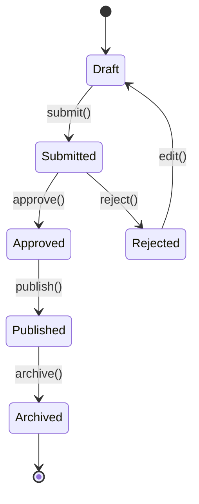

# Feature Specification Template

> Stage 3. 3-depth 트리. State machine, Edge case matrix, Empty/Loading/Error states 필수.

---

# Feature Specification — [프로젝트명]

> **Version**: v0.1
> **Reference**: 02-prd.md, 03-trd.md
> **Author**:

---

## 트리 구조 (예시)

```
1. 사용자 관리 (대분류)
   1.1 회원가입 / 로그인 (중분류)
       1.1.1 이메일 회원가입 (소분류)
       1.1.2 소셜 로그인
       1.1.3 비밀번호 재설정
   1.2 프로필 관리
       1.2.1 프로필 정보 수정
       1.2.2 아바타 업로드
2. [메인 기능 영역]
   2.1 ...
       2.1.1 ...
3. 알림 시스템
4. 결제
5. 관리자 도구
```

---

## 소분류 명세 (각 기능마다)

### N.N.N [기능명]

| 속성 | 값 |
|------|-----|
| **Priority** | P0 / P1 / P2 |
| **RICE Score** | (PRD에서) |
| **Status** | Draft / Review / Confirmed |
| **Estimate** | S/M/L/XL (또는 person-days) |
| **Owner** | TBD |
| **Feature Flag** | flag_name (해당 시) |

#### Description

**User Story**:
> "As a [persona], I want to [action] so that [outcome]"

**System Behavior**:
[시스템이 어떻게 처리하는지]

#### Inputs

| 필드 | 타입 | 제약 | Validation |
|------|-----|-----|-----------|
| email | string | 1-255 char | RFC 5322 |
| password | string | 8+ char | 영문/숫자 포함 |
| name | string | 1-50 char | UTF-8 |

#### Outputs

**Success (200/201)**:
```json
{
  ...
}
```

**Failure**:
| 에러 | HTTP | Body |
|------|------|------|
| Validation | 400 | `{ error: "..." }` |
| Conflict | 409 | `{ error: "..." }` |

#### Dependencies

- **Internal**: 기능 ID [1.2.x]
- **External**: [API/Service 이름]
- **DB Tables**: users, sessions
- **Feature Flags**: [flag 이름]

#### Business Logic

1. Validate input
2. Check duplicate
3. Hash password (bcrypt)
4. Insert into DB
5. Send welcome email (async)
6. Return session token

---

#### ⭐ State Machine (해당 시)



**State 정의**:
| State | 의미 | 가능한 액션 |
|-------|-----|----------|
| Draft | 초안 | submit, edit, delete |
| Submitted | 제출 | approve, reject |
| Approved | 승인 | publish |
| Published | 공개 | archive |

상태 5개 이상이면 State machine 필수.

---

#### ⭐ Edge Cases Matrix

| Input / State | Expected Behavior |
|---|---|
| 빈 입력 | 폼 제출 비활성화 + 인라인 에러 |
| 최대 길이 초과 | 입력 차단 + counter 표시 |
| 특수문자 (스크립트, SQL) | Sanitize, 에러 X |
| Unicode (이모지, 한자) | 정상 처리 |
| 권한 없음 | 403 + "권한이 필요합니다" |
| 만료 세션 | 401 + 로그인 페이지로 |
| 네트워크 끊김 | 로컬 저장 + 재연결 시 동기화 |
| 동시 수정 (다른 사용자) | Optimistic locking, 충돌 시 사용자 선택 |
| Rate limit 초과 | 429 + 재시도 시간 표시 |
| 페이지 새로고침 중 | Draft 자동 저장 복원 |

5건 이상 명시 권장.

---

#### ⭐ Empty / Loading / Error States

**Empty State** (데이터 없음):
- 아이콘 + 메시지: "아직 [데이터]가 없습니다"
- 첫 [데이터] 생성 CTA 버튼
- 예시 데이터로 안내 (해당 시)
- (참고 이미지 / 설명)

**Loading State**:
- < 1초: Skeleton screen
- 1~5초: Spinner + 텍스트
- > 5초: "오래 걸리고 있어요" 안내 + 취소 옵션

**Error States**:
- **Validation error**: 인라인 필드 옆 빨간 메시지
- **Server error (5xx)**: 상단 toast + 재시도 버튼
- **Network error**: 오프라인 모드 안내
- **Permission error**: 모달로 권한 요청
- **Rate limit error**: "잠시 후 다시 시도" + 카운트다운

---

#### ⭐ Accessibility

- [ ] 키보드 navigation (Tab 순서 논리적)
- [ ] Focus indicator 명확
- [ ] Screen reader labels (`aria-label`, `aria-describedby`)
- [ ] Live region (`aria-live="polite"`)
- [ ] Color contrast 4.5:1+
- [ ] Touch target 44x44px+
- [ ] Error 메시지 announce
- [ ] Form 모든 input에 `<label>`

---

#### ⭐ Analytics Events

표준 4가지 이벤트:

```
- [feature]_initiated   (사용자가 시작)
- [feature]_completed   (성공 완료)
- [feature]_failed      (실패) — error_type prop
- [feature]_abandoned   (중도 포기)
```

**Example for signup**:
```json
{
  "event": "user_signup_initiated",
  "properties": {
    "source": "landing_page" | "pricing_page" | "...",
    "method": "email" | "google" | "kakao"
  }
}

{
  "event": "user_signup_completed",
  "properties": {
    "method": "email",
    "duration_ms": 12500
  }
}

{
  "event": "user_signup_failed",
  "properties": {
    "method": "email",
    "error_type": "email_taken" | "weak_password" | "...",
    "step": "email_input" | "password_input" | "..."
  }
}

{
  "event": "user_signup_abandoned",
  "properties": {
    "method": "email",
    "last_step": "email_input",
    "duration_ms": 8000
  }
}
```

→ 전체 event taxonomy: `05-analytics-plan.md`

---

#### Test Cases

**Happy path**:
- [ ] 정상 입력 → 성공 응답

**Error paths**:
- [ ] 잘못된 이메일 형식
- [ ] 중복 이메일
- [ ] 약한 비밀번호
- [ ] 네트워크 끊김
- [ ] 서버 에러 (mock 5xx)

**Performance**:
- [ ] 응답 시간 < 200ms (P95)
- [ ] 동시 100 요청 처리

**Accessibility**:
- [ ] 키보드만으로 완료
- [ ] VoiceOver 테스트 통과
- [ ] 색맹 시뮬레이션 통과

---

#### Related

- PRD: `02-prd.md` Section [N]
- TRD: `03-trd.md` API [endpoint]
- User Flow: `04-user-flow.md` [flow]
- Analytics: `05-analytics-plan.md` events

---

## Priority 분류 (자동, RICE 기반)

| RICE Range | Priority | Meaning |
|-----------|---------|---------|
| Top 30% | P0 | 출시 필수 |
| 30~70% | P1 | 출시 후 빠르게 |
| Bottom 30% | P2 | 보류 / Future |

---

## Status 흐름

| Status | When |
|--------|------|
| Draft | 초안 작성 중 |
| Review | PRD-writer 검토 요청 |
| Confirmed | 사용자 확정 → 개발 가능 |
| In Progress | 개발 중 |
| Done | QA 통과 |
| Deferred | 보류 |
| Cut | 범위 제외 |
