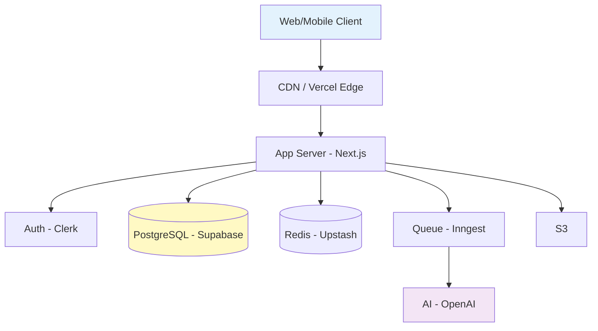
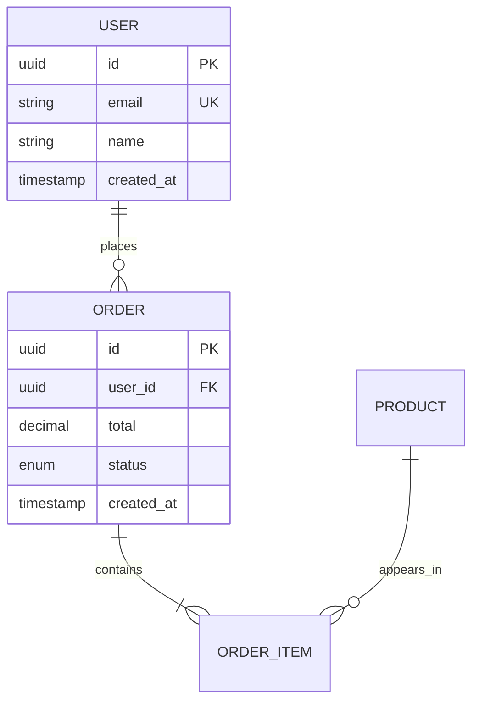

# TRD Template — Technical Requirements Document

> Stage 3. 글로벌 SaaS 회사 Staff Engineer 수준 기술 설계서.

---

# TRD — [프로젝트명]

> **Version**: v0.1
> **Status**: Draft / Review / Approved
> **Reference**: 02-prd.md, 02-one-pager.md
> **Author**:

---

## 1. Overview

[한 줄 시스템 설명]

### 핵심 기술적 도전
- ...
- ...

---

## 2. Assumptions

설계의 기반이 되는 가정. 바뀌면 설계 재검토.

- 동시 활성 사용자 1만명 이내 (1년)
- 평균 요청 80% 읽기, 20% 쓰기
- 일일 데이터 증가 < 10GB
- ...

---

## 3. System Architecture

### High-level Diagram



### Data Flow (주요 시나리오)

#### 시나리오 1: [회원가입]
```
1. Client → POST /api/auth/signup
2. Server → Clerk API
3. Clerk → 인증 토큰
4. Server → DB INSERT users
5. Server → Queue (welcome email)
6. Client ← 200 OK
```

#### 시나리오 2: [메인 기능]
[다이어그램]

---

## 4. Tech Stack

| Layer | Technology | Why | Alternatives Considered |
|-------|-----------|-----|---------------------|
| Frontend | Next.js 14 | SSR/RSC, Vercel | Remix, SvelteKit |
| Language | TypeScript 5+ | 타입 안정성 | (필수) |
| Styling | Tailwind CSS | 속도, 일관성 | CSS Modules |
| State | Zustand + React Query | 가벼움 | Redux Toolkit |
| Backend | Next.js API + tRPC | Type-safe | Hono, NestJS |
| DB | PostgreSQL (Supabase) | 관계형+JSON, RLS | MongoDB, MySQL |
| ORM | Prisma | Type-safe migration | Drizzle, Kysely |
| Auth | Clerk | 빠른 통합 | NextAuth, Supabase Auth |
| Cache | Upstash Redis | Serverless | Memcached |
| Queue | Inngest | Vercel 호환 | BullMQ, SQS |
| Storage | S3 / R2 | 표준 | Supabase Storage |
| Hosting | Vercel | Next.js 최적 | AWS Amplify, Cloudflare |
| Monitoring | Sentry + Vercel | 통합 | Datadog |
| Email | Resend | 개발자 친화 | SendGrid |

---

## 5. Data Model

### ERD



### Schema (Prisma)

```prisma
model User {
  id        String   @id @default(uuid())
  email     String   @unique
  name      String
  orders    Order[]
  createdAt DateTime @default(now())
  updatedAt DateTime @updatedAt

  @@index([email])
}

model Order {
  id        String      @id @default(uuid())
  userId    String
  user      User        @relation(fields: [userId], references: [id])
  total     Decimal     @db.Decimal(10, 2)
  status    OrderStatus @default(PENDING)
  createdAt DateTime    @default(now())

  @@index([userId, createdAt])
}

enum OrderStatus {
  PENDING
  CONFIRMED
  DELIVERING
  DELIVERED
  CANCELLED
}
```

### Migration Strategy
- 모든 schema 변경 Prisma migration
- Breaking change 두 단계 deploy
- Production migration 전 staging 검증

---

## 6. API Contract

### `POST /api/v1/auth/signup`

**Request**:
```json
{
  "email": "user@example.com",
  "password": "string (8+ chars)",
  "name": "string"
}
```

**Response (201)**:
```json
{
  "user": {
    "id": "uuid",
    "email": "user@example.com",
    "name": "string"
  },
  "session": {
    "token": "jwt",
    "expiresAt": "ISO-8601"
  }
}
```

**Error responses**:
| Code | Reason | Body |
|------|--------|------|
| 400 | Validation | `{ error: "email_invalid" \| "password_weak" }` |
| 409 | Email exists | `{ error: "email_taken" }` |
| 500 | Server error | `{ error: "internal" }` |

**Rate limit**: 10/min per IP
**Auth**: None

### [추가 endpoint들 ...]

### API 디자인 원칙
- Versioning: `/api/v1/...`
- Naming: 명사 복수형, kebab-case
- Errors: 표준 형식, machine-readable code
- Pagination: cursor-based
- Rate limiting: per-endpoint

---

## 7. External Dependencies

| 서비스 | 용도 | SLA | 비용 | Fallback |
|--------|-----|-----|-----|---------|
| Clerk | 인증 | 99.9% | $25/mo + $0.02/MAU | Cached session |
| Supabase | DB | 99.9% | $25/mo Pro | Read replica |
| OpenAI | AI | 99.5% | $X/1M tokens | Anthropic |
| Stripe | 결제 | 99.99% | 2.9% + ₩300 | 토스페이먼츠 |
| Resend | 이메일 | 99% | $20/mo | SendGrid |

### Vendor Lock-in 평가
- High: Clerk (migration 어려움)
- Medium: Supabase (Postgres portable)
- Low: OpenAI (swap 가능)

### 비용 예측 (월간)

| 항목 | 100명 | 1,000명 | 10,000명 |
|------|------|--------|---------|
| Vercel | $20 | $50 | $200 |
| Supabase | $25 | $100 | $500 |
| Clerk | $25 | $45 | $225 |
| OpenAI | $50 | $300 | $2,000 |
| **Total** | $120 | $495 | $2,925 |

---

## 8. Non-Functional Requirements

### Performance
| 지표 | 목표 | 측정 |
|------|-----|-----|
| TTFB | < 200ms (P95) | Vercel Analytics |
| LCP | < 2.5s (P95) | Web Vitals |
| API latency | < 200ms (P95) | Sentry |

### Scalability
- 동시 사용자: 10K (1년), 100K (3년)
- 일일 요청: 1M (1년)
- Sharding: user_id 기반 (필요 시)

### Security
- OWASP Top 10 대응
- CSP, HSTS
- SQL injection (Prisma)
- XSS (React + sanitization)
- CSRF token
- Rate limiting
- Audit log

### Observability
- Logs: Structured JSON → Axiom
- Metrics: Vercel + Sentry
- Tracing: OpenTelemetry
- Alerts: PagerDuty (P0)

### Reliability
- Uptime SLO: 99.9%
- Error budget: 0.1%
- Backup: Daily, 30일
- DR: RPO 1h, RTO 4h

---

## 9. Build vs Buy Decisions (ADRs)

### ADR-001: 인증 시스템

**Status**: Accepted
**Context**: 인증, OAuth, 세션 관리
**Decision**: Clerk (Buy)
**Alternatives**:
- NextAuth (Build) — 자유도 ↑, 유지보수 ↓
- Supabase Auth — DB 통합 ↑, 기능 ↓
- 자체 구현 — 시간 ↑↑

**Consequences**:
- ✅ 1주일 → 1일
- ✅ 보안 검증
- ⚠️ $25/mo + per-MAU
- ⚠️ Vendor lock-in

**When to revisit**: MAU 100K

### ADR-002: [다음 결정]
[...]

### ADR-003: [다음 결정]
[...]

---

## 10. Migration / Rollback Plan

### 출시 단계
1. **Internal alpha** (1주) — 팀 dogfooding
2. **Closed beta** (2주) — 초청 100명
3. **Open beta** (1개월) — 누구나 가입, "Beta"
4. **GA** — Beta 제거

### Feature Flag
- LaunchDarkly / Vercel Flags
- 모든 신규 기능 flag 뒤에
- Rollback = flag off (배포 없이)

### DB Migration
- Backward-compatible 우선
- 컬럼 추가 OK, 삭제는 두 단계
- Staging 검증 후 Production
- Window: 화요일 새벽

### Rollback Criteria

**자동**:
- Error rate > 1% (5분)
- P95 latency > 1s (5분)

**수동**:
- 비즈니스 메트릭 50%+ 하락
- 보안 취약점
- 데이터 손상

### Communication
- Incident → PagerDuty
- Public 영향 → Status page
- Postmortem 작성 (blameless)

---

## 11. Open Technical Questions

- [ ] [Q1] — 결정 필요 시점: ...
- [ ] [Q2] — ...

---

## Changelog

| Version | Date | Author | Changes |
|---------|------|--------|---------|
| v0.1 | YYYY-MM-DD | | Initial |
