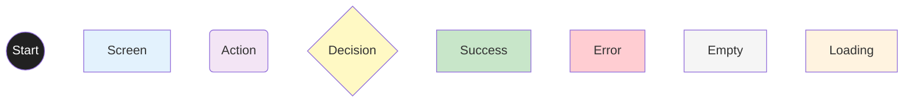
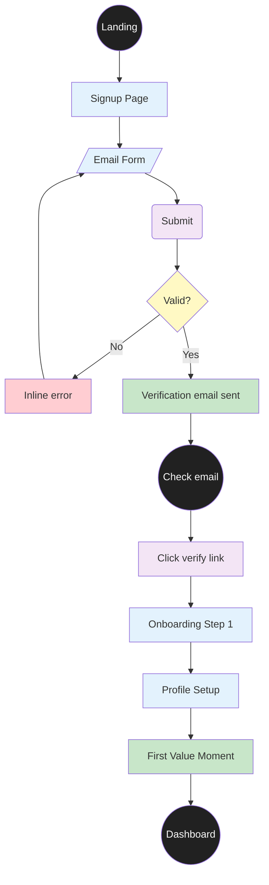
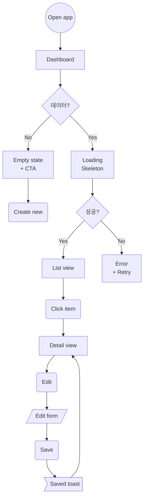
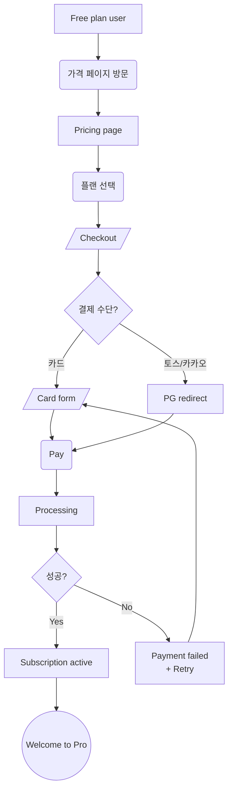
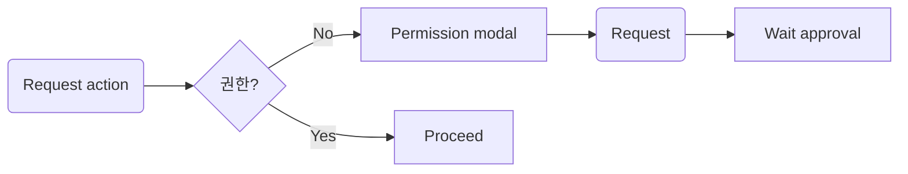
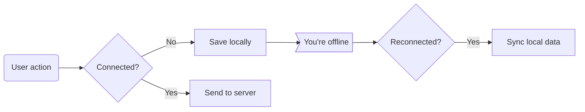
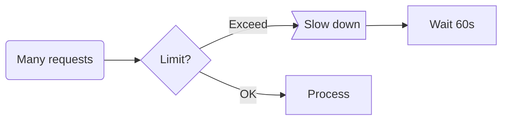
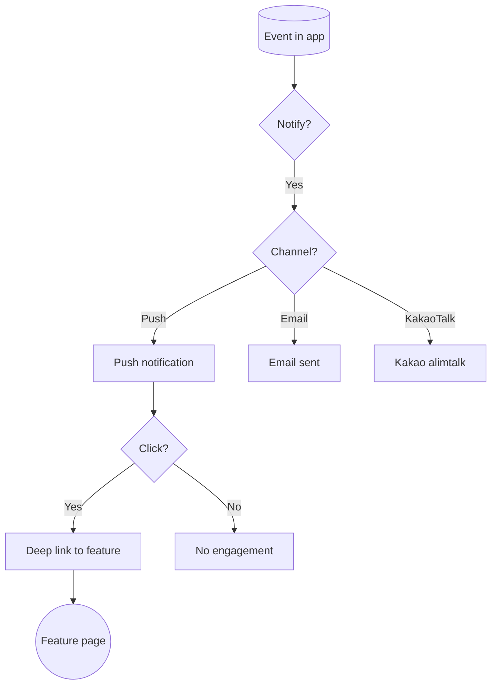
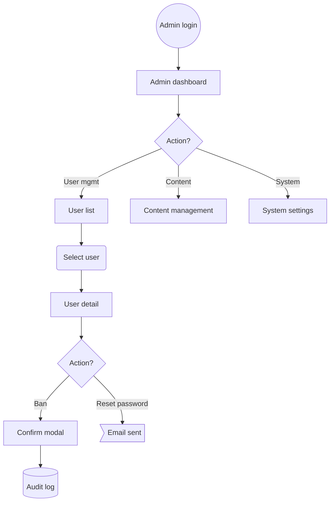

# User Flow Template

> Stage 4 산출물 2/2. Mermaid 다이어그램으로 시각화.

---

# User Flows — [프로젝트명]

> **Version**: v0.1
> **Reference**: 02-prd.md, 03-feature-spec.md, 04-information-architecture.md

---

## Mermaid 표기법

### Node Types
- `A[Rectangle]` — 화면/페이지
- `B(Rounded)` — 사용자 액션
- `C{Diamond}` — 분기/조건
- `D[(Cylinder)]` — 데이터/저장
- `E((Circle))` — 시작/종료
- `F>Banner]` — 알림/Toast
- `G[/Trapezoid/]` — 입력 폼

### Color Coding (일관성)

---

## Flow 카테고리 (모두 작성)

### 1. Onboarding Flow

> 첫 사용자가 핵심 가치를 경험하는 흐름. "Time to Value" 단축이 핵심.

**핵심 지표**:
- Activation rate (Signup → First value)
- Time to first value
- Drop-off per step

---

### 2. Main Usage Flow (Persona별)

#### Persona A: [페르소나명] 메인 사용

#### Persona B: [페르소나명] 메인 사용
[다이어그램]

---

### 3. Payment / Conversion Flow

---

### 4. Error / Exception Flows

#### 권한 없음

#### 오프라인

#### Rate Limit

---

### 5. Notification / Retention Flow

---

### 6. Admin Flow (해당 시)

---

## Mobile vs Desktop

플로우가 다르다면 분리:

### Mobile-specific
- 단일 column
- Bottom nav
- Swipe gestures
- 한 손 사용 고려

### Desktop-specific
- Multi-column
- Keyboard shortcuts
- Hover interactions
- Multi-window

---

## Interaction Details

플로우 노드만 그리지 말고 인터랙션 디테일도:
- Hover state
- Active state
- Disabled state
- Animation 타이밍 (200~300ms 권장)
- Haptic feedback (모바일)

---

## ⭐ WCAG 2.1 AA 체크리스트

### Perceivable
- [ ] alt text 모든 의미 있는 이미지
- [ ] 색상 대비 4.5:1+ (텍스트), 3:1+ (UI)
- [ ] 색상만으로 정보 전달 ❌
- [ ] 자막 (영상)

### Operable
- [ ] 키보드만으로 모든 기능 사용 가능
- [ ] Focus indicator 명확
- [ ] Skip navigation 링크
- [ ] Touch target 44x44px+
- [ ] 시간 제한 → 연장 옵션

### Understandable
- [ ] 명확한 라벨 + 지시문
- [ ] Inline error + 구체적
- [ ] Predictable navigation
- [ ] Auto-complete

### Robust
- [ ] Valid HTML
- [ ] ARIA 적절 사용
- [ ] Screen reader 테스트

---

## 검증 질문

각 플로우 완료 후:
- [ ] 페르소나가 명확한가?
- [ ] Happy path만 있지 않은가?
- [ ] Empty/Loading/Error state 포함?
- [ ] Drop-off 가능 지점 명시?
- [ ] 모바일 호환?
- [ ] Accessibility 고려?
- [ ] 노드 명이 구체적? ("처리" 같은 모호함 X)
